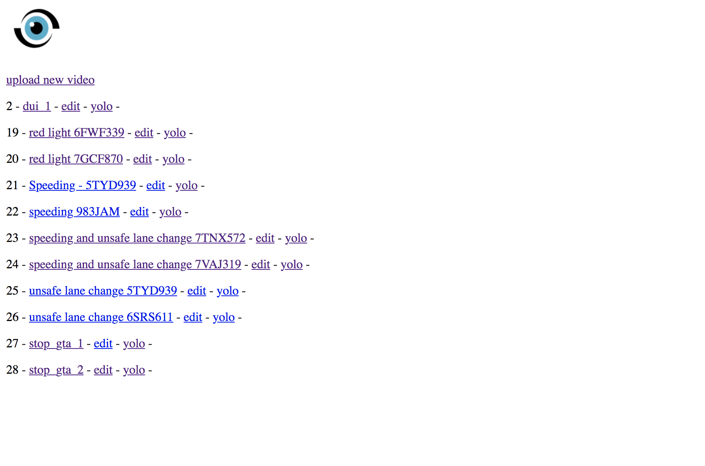
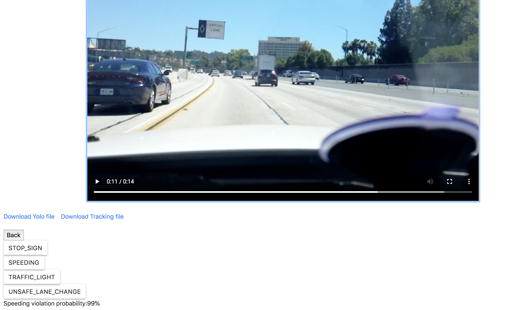

# ML_b
a website integrated with YOLO v3, kalman-filter and a couple of ML models to detect traffic violations.
only webiste source code
# Tehnique
- Django
- Tensorflow

# How to use

### Acquire data
upload traffic violation possibly video, choose the model (yolo or tracking)you want to use and get the data json file.

### Find violation
- [x] speeding
- [x] stop sign
- [ ] traffic light
- [ ] unsafe lane change

# Step by Step
### Home page - login

### find the video you want to process or upload your own traffic violation video

### Speeding

### stop_sign(work perfectly in video game GTA V)

# TODO
- [x] upload video
- [ ] connect to CarmaCam db
- [x] connect to ML model
- [ ] add openalpr into backend
...
