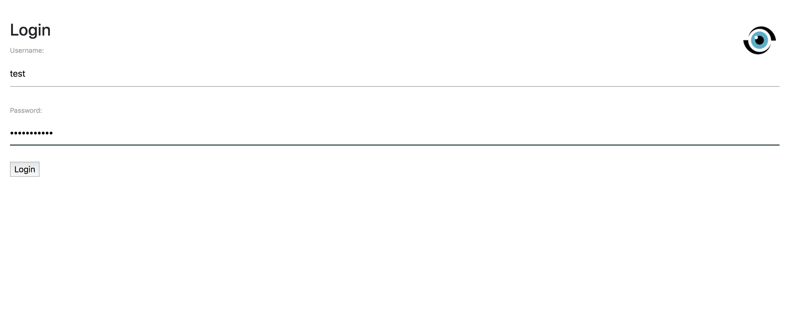
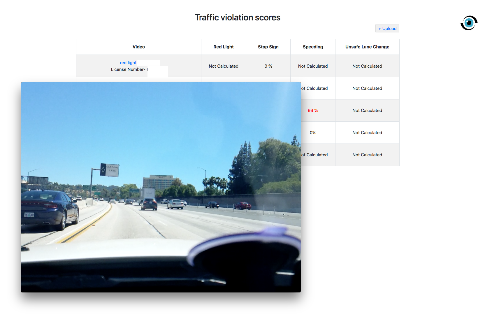
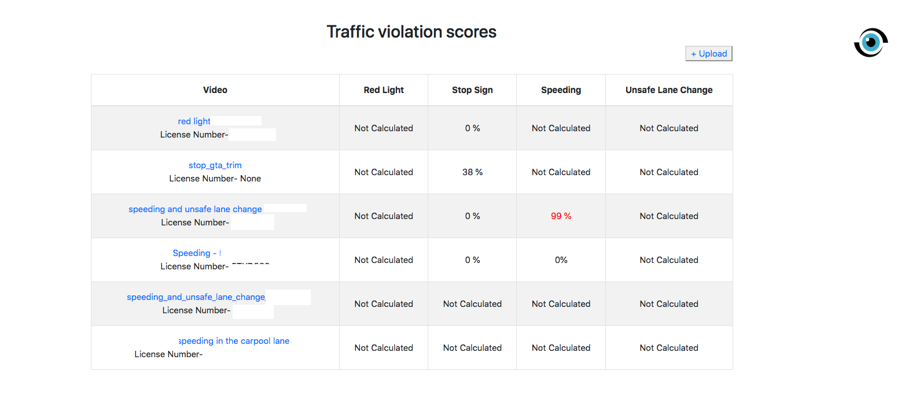
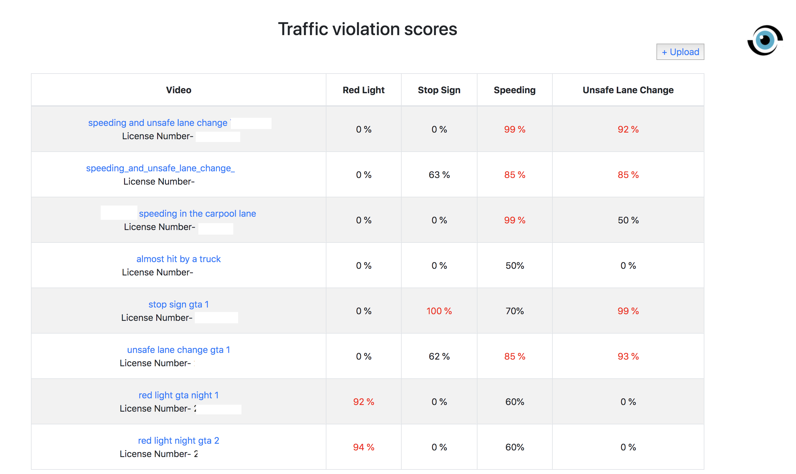

# CarmaCam scoring module platform
a website, ML pipline integrated with YOLO v3, kalman-filter, OpenALPR and a couple of ML models to process video data, detect traffic violations.
only webiste source code
# Tehnique
- Django
- Tensorflow

# How to use

### Acquire data
upload traffic violation possibly video, choose the model (yolo or tracking)you want to use and get the data json file.

### Calculate violation possibilities
- [x] speeding
- [x] stop sign
- [ ] traffic light
- [ ] unsafe lane change

# Step by Step
### Home page - login

### Select a possible traffic violation video

### Upload video

### video is processing on the backend service and will take few minutes to calculate

### result!!!

### stop_sign(do work in video game GTA V and real life video)

# TODO
- [x] upload video
- [ ] connect to CarmaCam db
- [x] connect to ML model
- [x] add openalpr into backend
...
